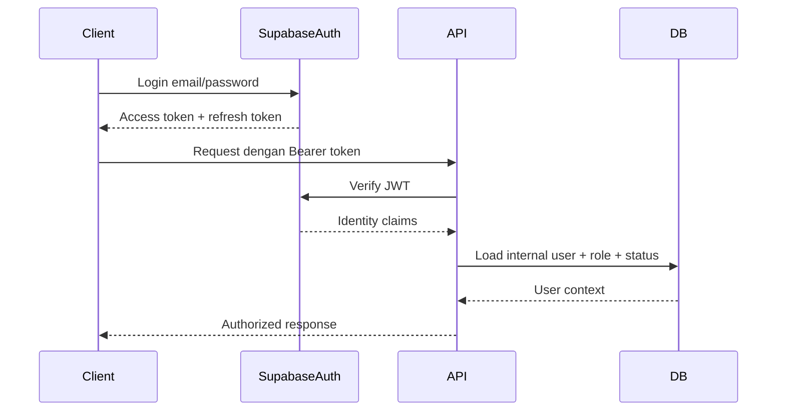
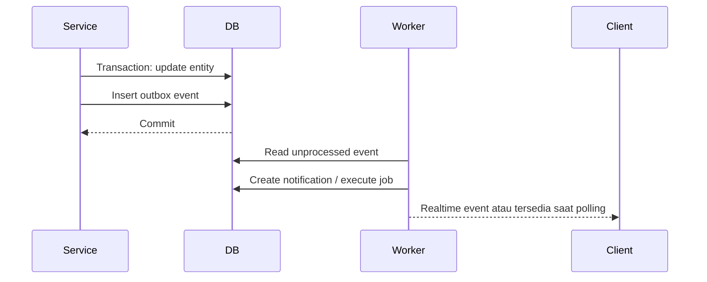
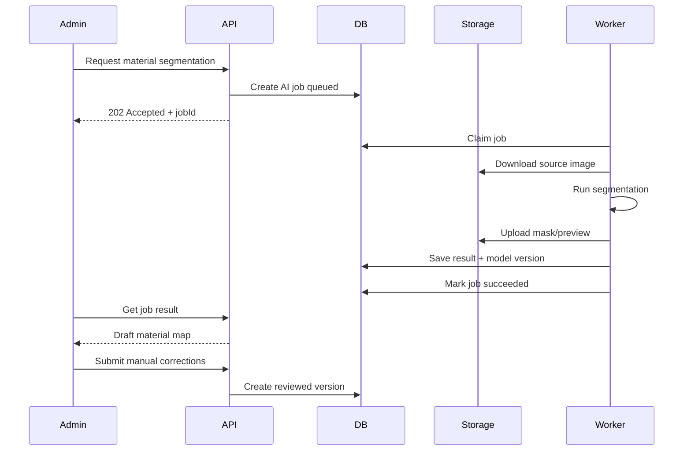
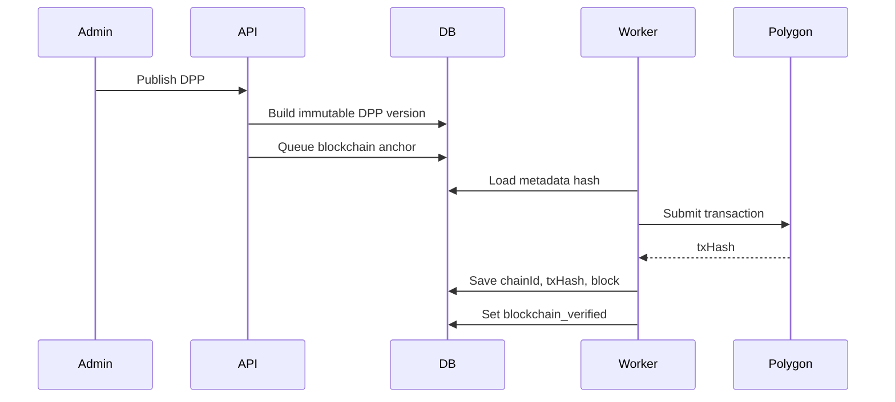
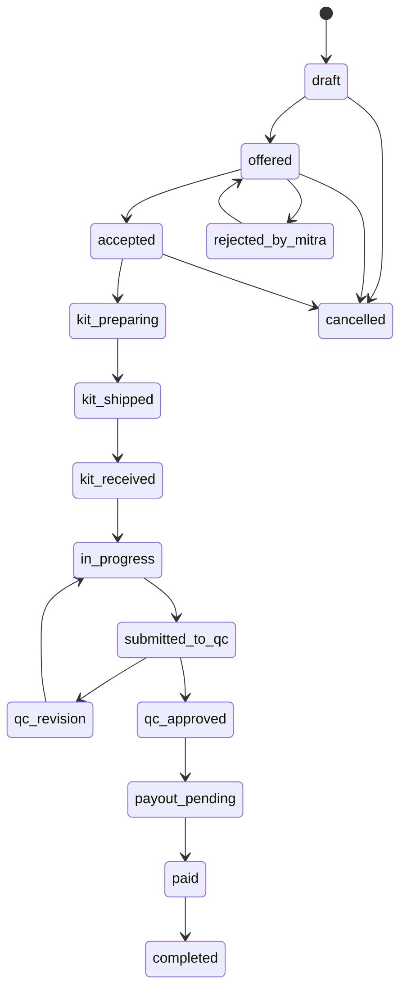
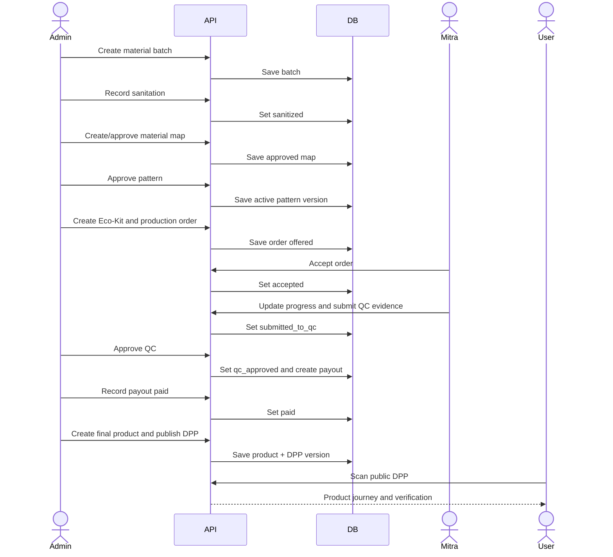
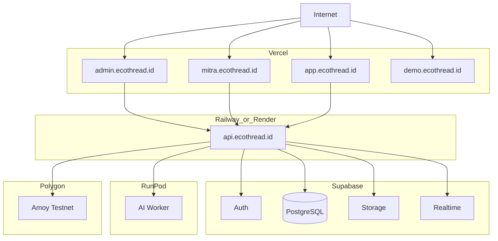

# System Architecture
# EcoThread — Platform Manufaktur Sirkular Terdesentralisasi

**Versi:** 1.0  
**Status:** Proposed Architecture  
**Pemilik:** Tim EcoThread  
**Dokumen Acuan:** `PRD_EcoThread_v1.0.md` dan `Salinan dasar ide(3).pdf`  
**Target:** MVP GEMASTIK XIX — Divisi Bisnis TIK  
**Terakhir diperbarui:** 27 Juli 2026

---

## 1. Tujuan Dokumen

Dokumen ini mendefinisikan arsitektur teknis yang menjadi patokan implementasi EcoThread.

Dokumen ini menjawab:

- bagaimana aplikasi Admin, Mitra, dan User saling terhubung;
- bagaimana data material sampai DPP disimpan;
- bagaimana autentikasi dan otorisasi dijalankan;
- bagaimana proses AI dipisahkan dari aplikasi utama;
- bagaimana Quality Control, pembayaran, dan audit log dijaga;
- bagaimana sistem di-deploy;
- bagaimana aplikasi lama dimigrasikan tanpa membuat ulang seluruh UI;
- batas antara fitur MVP dan fitur masa depan.

PRD menjelaskan **apa yang harus dibangun**. Dokumen arsitektur ini menjelaskan **bagaimana sistem dibangun**.

---

## 2. Sasaran Arsitektur

Arsitektur harus mendukung satu vertical slice yang benar-benar berjalan:

```text
Admin mencatat material
→ material didigitalisasi
→ pola divalidasi
→ Eco-Kit dibuat
→ order diberikan kepada Mitra
→ Mitra mengerjakan dan mengirim bukti
→ Admin melakukan QC
→ pembayaran Mitra dicatat
→ produk final dan QR DPP dibuat
→ User memindai DPP
```

### Sasaran Teknis

1. Ketiga role menggunakan satu sumber data yang sama.
2. Data tetap tersimpan setelah refresh dan pergantian perangkat.
3. Hak akses diperiksa oleh backend.
4. Setiap perubahan status penting memiliki audit trail.
5. Proses AI berjalan asynchronous dan tidak memblokir request utama.
6. Kegagalan AI atau blockchain tidak merusak alur produksi utama.
7. DPP tetap dapat digunakan tanpa blockchain.
8. Aplikasi Mitra dan User optimal di perangkat seluler.
9. Sistem dapat dikembangkan oleh tim mahasiswa tanpa infrastruktur berlebihan.
10. Data demo dipisahkan dari data pilot aktual.

---

## 3. Prinsip Arsitektur

### 3.1 Modular Monolith First

Backend dibangun sebagai **modular monolith**, bukan microservices penuh.

Alasan:

- tim kecil;
- waktu kompetisi terbatas;
- transaksi lintas modul masih kuat;
- deployment dan debugging lebih sederhana;
- dapat dipisah menjadi service mandiri setelah kebutuhan skalabilitas terbukti.

Modul backend tetap memiliki batas yang jelas agar dapat diekstrak pada masa depan.

### 3.2 Backend as Source of Truth

Frontend tidak boleh menentukan status bisnis sendiri.

Contoh yang dilarang:

```javascript
setOrder({ ...order, status: "qc_approved" });
```

tanpa request ke backend.

Semua transisi status harus melalui service backend yang:

1. memeriksa role;
2. memeriksa status saat ini;
3. memeriksa business rule;
4. menyimpan perubahan;
5. menulis audit log;
6. mengirim notifikasi.

### 3.3 Human-in-the-Loop AI

AI hanya menghasilkan rekomendasi atau draft.

```text
AI output
→ review manusia
→ approved version
→ digunakan untuk produksi
```

Output tidak boleh diberi label `production-ready` sebelum disetujui Admin atau pattern validator.

### 3.4 Database-First DPP

DPP utama disimpan dalam PostgreSQL dan dapat dibuka melalui QR.

Blockchain berfungsi sebagai lapisan verifikasi tambahan:

```text
DPP Database
→ canonical metadata
→ metadata hash
→ Polygon anchoring
```

Kegagalan anchoring tidak boleh menghilangkan DPP.

### 3.5 Evidence-Based Operations

Status operasional tertentu membutuhkan bukti.

Contoh:

- sanitasi membutuhkan record operator dan waktu;
- QC membutuhkan checklist dan foto;
- pembayaran membutuhkan reference atau bukti transfer;
- blockchain verification membutuhkan transaction hash nyata.

### 3.6 Progressive Enhancement

Alur sederhana harus tetap bekerja saat integrasi tambahan belum tersedia.

Contoh:

- tanpa AI, Admin dapat membuat material map manual;
- tanpa blockchain, QR DPP tetap aktif;
- tanpa payment gateway, pembayaran dapat dicatat manual;
- tanpa realtime, aplikasi dapat menggunakan polling.

---

## 4. Keputusan Teknologi

| Area | Teknologi | Keputusan |
|---|---|---|
| Monorepo | pnpm workspaces | Ringan dan cocok untuk beberapa aplikasi |
| Frontend Web App | React + Vite + TypeScript (ADR-001) | Single Role-Based Web App (`apps/web`) |
| Explainer | React + Vite | Dipertahankan sebagai aplikasi demo terpisah |
| Backend API | Node.js + Fastify + TypeScript | Cepat, ringan, schema-friendly |
| Validation | Zod | Kontrak request/response bersama |
| ORM | Prisma | Migration, relation, type safety |
| Database | PostgreSQL melalui Supabase | Relasional dan managed |
| Authentication | Supabase Auth / JWT | Email/password dan token JWT |
| File Storage | Supabase Storage | Material, pola, QC, produk |
| Realtime | Supabase Realtime atau polling | Hanya untuk event yang dibutuhkan |
| AI Worker | Python + FastAPI | Isolasi dependency ML |
| AI Runtime | Lokal untuk development; RunPod/server GPU untuk demo | Tidak mengganggu backend |
| Background Job MVP | Tabel `jobs` di PostgreSQL | Menghindari Redis pada fase awal |
| Background Job Scale | BullMQ + Redis | Hanya setelah volume membutuhkannya |
| Blockchain | Polygon Amoy Testnet | Fitur P1/P2, bukan dependency core |
| API Documentation | OpenAPI | Kontrak yang dapat diuji |
| Testing Frontend | Vitest + React Testing Library | Unit/component test |
| Testing Backend | Vitest | Service dan integration test |
| E2E | Playwright | Skenario Admin–Mitra–User |
| Deployment Frontend | Vercel | Single Web App (`apps/web`), Explainer |
| Deployment API | Railway atau Render | Long-running Node service |
| Deployment AI | RunPod Serverless atau service Python terpisah | GPU hanya saat dibutuhkan |
| Monitoring | Sentry + structured logs | Error dan trace dasar |
| CI | GitHub Actions | Install, lint, test, build |

---

## 5. Context Diagram

```mermaid
flowchart LR
    ADMIN[Admin City Hub]
    MITRA[Mitra Penjahit]
    USER[User / Konsumen]
    CORP[Supplier / Korporasi]
    WEB[EcoThread Web App (apps/web)]
    API[EcoThread Backend API]
    DB[(PostgreSQL)]
    STORAGE[(Object Storage)]
    AI[AI Worker]
    CHAIN[Polygon]
    PAY[Payment Provider / Manual Transfer]
    LOGISTIC[Logistics Provider]

    ADMIN -->|Admin Dashboard| WEB
    MITRA -->|Mitra Portal| WEB
    USER -->|Public Catalog & DPP| WEB
    WEB --> API
    CORP -.->|Data sumber material / pilot| API

    API --> DB
    API --> STORAGE
    API --> AI
    API --> CHAIN
    API -.-> PAY
    API -.-> LOGISTIC
```

Garis putus-putus menunjukkan integrasi yang dapat dimulai secara manual pada MVP.

---

## 6. Container Architecture

```mermaid
flowchart TB
    subgraph Clients
        WEB_APP[Single Role-Based Web App (apps/web)]
        EXPLAINER[Explainer App]
    end

    subgraph Backend
        API[Fastify API]
        AUTH[Auth Adapter]
        JOBS[Job Dispatcher]
        EVENTS[Notification/Event Service]
    end

    subgraph Modules
        IDENTITY[Identity & RBAC]
        MATERIAL[Material]
        DESIGN[Design & Pattern]
        KIT[Eco-Kit]
        PRODUCTION[Production]
        QC[Quality Control]
        FINANCE[Payout]
        COMMERCE[Commerce]
        DPP[DPP & Impact]
        AUDIT[Audit]
    end

    subgraph Managed Infrastructure
        POSTGRES[(PostgreSQL)]
        STORAGE[(Supabase Storage)]
        SUPA_AUTH[Supabase Auth]
        REALTIME[Supabase Realtime]
    end

    subgraph Async Workers
        AI_WORKER[Python AI Worker]
        BLOCKCHAIN_WORKER[Blockchain Adapter]
        NOTIFICATION_WORKER[Notification Worker]
    end

    WEB_APP --> API

    API --> AUTH
    AUTH --> SUPA_AUTH

    API --> IDENTITY
    API --> MATERIAL
    API --> DESIGN
    API --> KIT
    API --> PRODUCTION
    API --> QC
    API --> FINANCE
    API --> COMMERCE
    API --> DPP
    API --> AUDIT

    IDENTITY --> POSTGRES
    MATERIAL --> POSTGRES
    DESIGN --> POSTGRES
    KIT --> POSTGRES
    PRODUCTION --> POSTGRES
    QC --> POSTGRES
    FINANCE --> POSTGRES
    COMMERCE --> POSTGRES
    DPP --> POSTGRES
    AUDIT --> POSTGRES

    API --> STORAGE
    API --> JOBS
    JOBS --> POSTGRES
    AI_WORKER --> POSTGRES
    AI_WORKER --> STORAGE
    BLOCKCHAIN_WORKER --> POSTGRES
    NOTIFICATION_WORKER --> POSTGRES
    EVENTS --> REALTIME
```

---

## 7. Struktur Repository

> **Perubahan Arsitektur (ADR-001):** Tiga aplikasi frontend terpisah (`apps/admin`, `apps/mitra`, `apps/user`) dikonsolidasikan ke dalam satu role-based Web Application di `apps/web`. Folder legacy tetap disimpan sementara sebagai referensi migrasi.

```text
Gemastik-XIX/
├── apps/
│   ├── web/                           # Single Role-Based Web App (React + Vite + TS)
│   │   ├── src/
│   │   │   ├── app/                   # App Router, Layouts, Providers, Route Guards
│   │   │   ├── pages/                 # Public, Auth, Admin, Mitra, Error Pages
│   │   │   ├── features/              # Domain-specific feature modules
│   │   │   ├── components/            # Navigation, Feedback, UI Design System
│   │   │   ├── lib/                   # API SDK Client, Env Validation, Route helpers
│   │   │   └── styles/                # CSS Design Tokens & Globals
│   │   ├── public/
│   │   ├── index.html
│   │   ├── package.json
│   │   ├── tsconfig.json
│   │   ├── vite.config.ts
│   │   └── vercel.json
│   │
│   ├── admin/                         # Temporary legacy reference (ADR-001)
│   ├── mitra/                         # Temporary legacy reference (ADR-001)
│   ├── user/                          # Temporary legacy reference (ADR-001)
│   ├── explainer/                     # Interactive Demo App
│   ├── api/                           # Core Fastify + TypeScript API Server
│   └── ai-worker/                     # Python FastAPI AI Worker

│   │   │   ├── app.ts
│   │   │   └── server.ts
│   │   └── package.json
│   │
│   └── ai-worker/
│       ├── app/
│       ├── models/
│       ├── tests/
│       ├── requirements.txt
│       └── Dockerfile
│
├── packages/
│   ├── api-client/
│   ├── contracts/
│   ├── ui/
│   ├── config/
│   ├── eslint-config/
│   └── tsconfig/
│
├── prisma/
│   ├── schema.prisma
│   ├── migrations/
│   └── seed.ts
│
├── docs/
│   ├── prd/
│   │   └── PRD_EcoThread_v1.0.md
│   ├── architecture/
│   │   ├── system-architecture.md
│   │   ├── database-schema.md
│   │   ├── api-contract.md
│   │   └── status-workflow.md
│   └── tasks/
│
├── scripts/
│   ├── migrate-legacy/
│   └── seed-demo/
│
├── .github/
│   └── workflows/
│       ├── ci.yml
│       └── deploy.yml
│
├── .env.example
├── pnpm-workspace.yaml
├── package.json
└── README.md
```

### Pemetaan Aplikasi Lama

```text
echothread-superadmin-app → apps/admin
ecothread-mitra-react     → apps/mitra
ecothread-dpp-customer    → apps/user
ecothread-animation-demo  → apps/explainer
```

File `fix*.js`, `patch*.js`, dan script sementara tidak ditempatkan di folder source utama. Script yang masih dibutuhkan dipindahkan ke `scripts/migrate-legacy/`; sisanya dihapus setelah diverifikasi.

---

## 8. Batas Modul Backend

## 8.1 Identity Module

Tanggung jawab:

- profil user;
- mapping Supabase identity ke user internal;
- role;
- verifikasi Mitra;
- permission;
- session context.

Tidak bertanggung jawab atas:

- password storage;
- token issuing.

Keduanya ditangani Supabase Auth.

---

## 8.2 Material Module

Tanggung jawab:

- sumber material;
- batch material;
- sorting;
- sanitasi;
- foto;
- status;
- berat dan area;
- allocation history.

Invariant:

- material yang belum `sanitized` tidak dapat menjadi input pola;
- berat tidak boleh negatif;
- material `rejected` tidak dapat dialokasikan;
- perubahan berat harus memiliki alasan.

---

## 8.3 Design and Pattern Module

Tanggung jawab:

- material map;
- AI job;
- design request;
- design output;
- pattern;
- pattern version;
- human approval.

Invariant:

- AI output selalu `draft`;
- hanya pattern version `approved` yang dapat digunakan Eco-Kit;
- satu pattern hanya memiliki satu active approved version;
- model name dan version disimpan.

---

## 8.4 Eco-Kit Module

Tanggung jawab:

- paket material;
- pola;
- aksesori;
- tag;
- checklist;
- packaging;
- shipment preparation.

Invariant:

- Eco-Kit hanya `ready` jika checklist lengkap;
- Eco-Kit hanya terkait satu production order aktif;
- material allocation tidak boleh melebihi ketersediaan.

---

## 8.5 Production Module

Tanggung jawab:

- production order;
- assignment;
- acceptance;
- timeline;
- progress;
- evidence;
- deadline;
- issue.

Invariant:

- Mitra harus terverifikasi;
- skill Mitra harus sesuai;
- Mitra menyetujui fee dan deadline;
- transisi status harus mengikuti state machine.

---

## 8.6 Quality Control Module

Tanggung jawab:

- QC submission;
- checklist;
- temuan;
- revisi;
- keputusan;
- bukti.

Invariant:

- approval membutuhkan checklist;
- reviewer dan waktu wajib;
- reject tidak dapat menghasilkan product record;
- histori revisi tidak boleh ditimpa.

---

## 8.7 Payout Module

Tanggung jawab:

- payout eligibility;
- fee;
- bonus;
- deduction;
- payment reference;
- proof;
- status.

Invariant:

- payout dibuat setelah QC approved;
- status `paid` membutuhkan reference;
- perubahan nominal ditulis ke audit log;
- payout harus idempotent.

---

## 8.8 Commerce Module

Tanggung jawab:

- katalog;
- customer order;
- pre-order;
- deposit;
- payment record;
- shipment;
- cancellation;
- review;
- Eco-Trade;
- Eco-Credits.

Invariant:

- customer order dianggap traction hanya jika deposit/payment terverifikasi;
- credit ledger bersifat append-only;
- order tidak dapat selesai sebelum delivered atau dikonfirmasi.

---

## 8.9 DPP and Impact Module

Tanggung jawab:

- final product;
- product-material relation;
- public DPP;
- product timeline;
- impact record;
- metadata version;
- QR;
- blockchain anchoring.

Invariant:

- satu product code unik;
- QR mengarah ke permanent route;
- impact record memiliki formula version;
- `blockchain_verified=true` hanya setelah transaksi terkonfirmasi;
- perubahan metadata menghasilkan versi baru.

---

## 8.10 Audit Module

Tanggung jawab:

- audit log;
- actor;
- entity;
- before/after;
- request correlation;
- timestamp.

Audit log tidak dapat diedit melalui aplikasi.

---

## 9. Authentication dan Authorization

## 9.1 Authentication Flow



### Keputusan

- token diterbitkan oleh Supabase Auth;
- backend memvalidasi token;
- role internal diambil dari database;
- frontend tidak dipercaya sebagai sumber role;
- akun Mitra memiliki status verifikasi terpisah.

## 9.2 Role

```text
admin
mitra
user
```

Status Mitra:

```text
pending_verification
active
suspended
rejected
inactive
```

## 9.3 Permission Enforcement

Setiap route menggunakan guard:

```typescript
requireRole(["admin"])
requireRole(["mitra"])
requireRole(["user", "mitra", "admin"])
requireVerifiedMitra()
requireEntityOwnership()
```

### Contoh

Mitra hanya dapat membaca production order ketika:

```text
production_order.mitra_id == current_user.mitra_profile.id
```

User hanya dapat membaca customer order ketika:

```text
customer_order.user_id == current_user.id
```

DPP published bersifat publik.

---

## 10. Database Architecture

## 10.1 Database Type

PostgreSQL digunakan karena:

- relasi antarentitas kuat;
- transaksi dibutuhkan;
- status dan constraint perlu dijaga;
- audit dan reporting membutuhkan query relasional;
- kompatibel dengan Supabase dan Prisma.

## 10.2 Domain Group

### Identity

```text
users
user_profiles
mitra_profiles
mitra_skills
mitra_documents
addresses
```

### Material dan Design

```text
material_sources
material_batches
material_images
sanitization_records
material_maps
design_requests
design_outputs
patterns
pattern_versions
```

### Production

```text
eco_kits
eco_kit_items
production_orders
production_progress
production_evidence
production_issues
```

### QC dan Finance

```text
qc_reviews
qc_findings
payouts
payout_events
```

### Product dan Commerce

```text
products
product_materials
catalog_items
customer_orders
customer_order_items
payments
shipments
reviews
```

### DPP dan Circularity

```text
dpp_records
dpp_versions
dpp_events
impact_records
eco_trade_requests
eco_credit_ledger
```

### Platform

```text
jobs
notifications
audit_logs
outbox_events
```

## 10.3 ID Strategy

Gunakan UUID untuk primary key internal.

Kode yang ditampilkan kepada manusia menggunakan kode terpisah:

```text
MAT-2026-0001
KIT-2026-0001
ORD-2026-0001
PRD-2026-0001
DPP-2026-0001
```

Kode dibuat backend dan memiliki unique constraint.

## 10.4 Soft Delete

Entitas operasional menggunakan:

```text
deleted_at
deleted_by
```

Data berikut tidak dihapus permanen:

- production order;
- QC;
- payout;
- product;
- DPP;
- audit log;
- payment.

## 10.5 Concurrency

Record penting memiliki:

```text
version integer
updated_at timestamp
```

Update kritis memakai optimistic locking:

```sql
UPDATE production_orders
SET status = ?, version = version + 1
WHERE id = ? AND version = ?;
```

Jika jumlah row yang berubah `0`, client wajib reload data.

---

## 11. File Storage Architecture

## 11.1 Bucket

```text
private-materials
private-patterns
private-production
private-qc
private-mitra-documents
public-products
public-dpp
```

## 11.2 Access Rules

- material dan QC bersifat private;
- pola hanya dapat diakses Admin dan Mitra terkait;
- dokumen identitas Mitra hanya Admin;
- foto produk final dapat public;
- DPP hanya memuat aset yang disetujui untuk publik;
- upload dilakukan melalui signed URL;
- database menyimpan metadata file, bukan base64.

## 11.3 File Metadata

```text
id
bucket
object_path
original_name
mime_type
size_bytes
checksum
uploaded_by
entity_type
entity_id
visibility
created_at
```

## 11.4 Upload Validation

- image: JPEG, PNG, WebP;
- pattern: PDF, DXF sesuai kebutuhan;
- maksimal file ditetapkan per konteks;
- mime type diverifikasi backend;
- nama file di-randomize;
- EXIF sensitif dapat dihapus pada foto publik.

---

## 12. API Architecture

## 12.1 Style

API menggunakan REST JSON dengan prefix:

```text
/api/v1
```

Contoh:

```http
POST /api/v1/admin/material-batches
POST /api/v1/admin/production-orders/:id/assign
POST /api/v1/mitra/production-orders/:id/accept
GET  /api/v1/dpp/:productCode
```

## 12.2 Response Format

Success:

```json
{
  "data": {},
  "meta": {
    "requestId": "req_123"
  }
}
```

List:

```json
{
  "data": [],
  "meta": {
    "page": 1,
    "pageSize": 20,
    "total": 100,
    "requestId": "req_123"
  }
}
```

Error:

```json
{
  "error": {
    "code": "INVALID_STATUS_TRANSITION",
    "message": "Order harus berstatus submitted_to_qc.",
    "details": {}
  },
  "meta": {
    "requestId": "req_123"
  }
}
```

## 12.3 API Contract

Request dan response schema didefinisikan di:

```text
packages/contracts
```

Schema Zod dipakai untuk:

- validasi backend;
- type frontend;
- dokumentasi OpenAPI;
- integration test.

## 12.4 Pagination

Gunakan cursor pagination untuk timeline dan list besar; page pagination dapat digunakan untuk dashboard Admin pada MVP.

## 12.5 Idempotency

Endpoint kritis menerima header:

```http
Idempotency-Key: <uuid>
```

Wajib untuk:

- create payment;
- release payout;
- create product;
- anchor DPP;
- submit checkout.

---

## 13. Event dan Notification Architecture

Backend menggunakan transactional outbox.



Contoh event:

```text
MITRA_VERIFIED
ORDER_OFFERED
ORDER_ACCEPTED
KIT_SHIPPED
QC_SUBMITTED
QC_REVISION_REQUIRED
QC_APPROVED
PAYOUT_PAID
DPP_PUBLISHED
CUSTOMER_ORDER_PAID
ECO_TRADE_APPROVED
```

MVP dapat menggunakan polling setiap 30–60 detik. Realtime dipakai jika stabil.

---

## 14. Background Job Architecture

## 14.1 Tabel Job

```text
jobs
- id
- type
- status
- payload_json
- result_json
- attempts
- max_attempts
- run_after
- locked_at
- locked_by
- last_error
- created_at
- completed_at
```

Status:

```text
queued
running
succeeded
failed
cancelled
```

Jenis job:

```text
MATERIAL_SEGMENTATION
DESIGN_GENERATION
PATTERN_EXPERIMENT
DPP_METADATA_BUILD
BLOCKCHAIN_ANCHOR
NOTIFICATION_DELIVERY
IMPACT_RECALCULATION
```

## 14.2 Retry

- exponential backoff;
- maksimum percobaan;
- error terakhir disimpan;
- Admin dapat retry;
- job harus idempotent.

---

## 15. AI Architecture

## 15.1 Tujuan MVP

AI MVP berfokus pada:

1. upload foto material;
2. segmentasi area material;
3. koreksi manual;
4. estimasi area usable;
5. rekomendasi pola dari pattern library;
6. pencatatan model dan versi.

GarmageNet diposisikan sebagai adapter eksperimen, bukan dependency wajib alur utama.

## 15.2 AI Flow



## 15.3 AI Adapter Interface

```python
class MaterialSegmentationProvider:
    def segment(self, image_uri: str, calibration: dict) -> SegmentationResult:
        ...
```

```python
class PatternGenerationProvider:
    def generate(self, design_uri: str, constraints: dict) -> PatternDraft:
        ...
```

Provider dapat diganti tanpa mengubah domain service.

## 15.4 AI Result Metadata

Setiap hasil menyimpan:

```text
provider
model_name
model_version
parameters
input_checksum
output_checksum
started_at
completed_at
confidence
review_status
reviewed_by
```

## 15.5 Failure Policy

Jika AI gagal:

- job berstatus failed;
- Admin melihat alasan;
- Admin dapat retry;
- Admin dapat membuat material map manual;
- production flow tetap dapat dilanjutkan setelah manual approval.

---

## 16. DPP Architecture

## 16.1 Canonical DPP Record

DPP publik tidak membaca langsung seluruh tabel internal. Backend membangun snapshot metadata yang telah disanitasi.

```json
{
  "schemaVersion": "1.0",
  "productCode": "PRD-2026-0001",
  "product": {},
  "materialJourney": [],
  "maker": {},
  "qualityControl": {},
  "impact": {},
  "care": {},
  "circularity": {},
  "verification": {}
}
```

## 16.2 DPP Versioning

```text
dpp_records
  └── dpp_versions
        ├── version_number
        ├── metadata_json
        ├── metadata_hash
        ├── published_at
        └── superseded_at
```

Published version bersifat immutable.

Jika ada koreksi:

```text
version 1 → superseded
version 2 → published
```

## 16.3 Public Route

```text
https://app.ecothread.id/dpp/{productCode}
```

Route harus permanen.

## 16.4 Verification State

```text
database_verified
anchoring_pending
blockchain_verified
anchoring_failed
```

UI tidak boleh menggunakan badge blockchain untuk status selain `blockchain_verified`.

## 16.5 Blockchain Anchoring



Private key hanya berada pada environment worker.

---

## 17. Impact Metrics Architecture

Impact tidak ditulis sebagai angka hard-coded pada frontend.

```text
impact_methodologies
impact_records
```

### Methodology

```text
id
code
version
name
description
formula_json
source_reference
valid_from
valid_to
status
```

### Record

```text
product_id
methodology_id
input_json
result_json
calculated_at
reviewed_by
review_status
```

Contoh:

```json
{
  "inputs": {
    "materialWeightKg": 0.85,
    "materialType": "denim",
    "baselineFactorVersion": "v1"
  },
  "results": {
    "wasteDivertedKg": 0.85,
    "estimatedWaterSavedLiter": 1200,
    "estimatedCo2AvoidedKg": 1.8
  }
}
```

UI harus menggunakan kata **estimasi** kecuali metodologi telah divalidasi secara formal.

---

## 18. Production State Machine

Status production order:

```text
draft
offered
accepted
rejected_by_mitra
kit_preparing
kit_shipped
kit_received
in_progress
submitted_to_qc
qc_revision
qc_approved
payout_pending
paid
completed
cancelled
```

### Allowed Transition



Transisi disimpan di satu service pusat:

```text
ProductionOrderTransitionService
```

Frontend tidak menduplikasi aturan transisi.

---

## 19. Core End-to-End Sequence



---

## 20. Commerce Architecture

MVP commerce mendukung:

- katalog;
- produk ready stock atau pre-order;
- deposit atau full payment;
- bukti pembayaran manual atau payment gateway;
- order tracking.

Payment adapter:

```typescript
interface PaymentProvider {
  createPayment(input: CreatePaymentInput): Promise<PaymentSession>;
  verifyPayment(reference: string): Promise<PaymentStatus>;
  refund?(reference: string, amount: number): Promise<RefundResult>;
}
```

Provider MVP:

```text
ManualTransferProvider
```

Provider selanjutnya:

```text
MidtransProvider
XenditProvider
```

Business logic tidak tergantung langsung pada vendor.

---

## 21. Integration Boundaries

## 21.1 Logistics

MVP:

- Admin mengisi nomor resi dan status manual;
- Mitra mengonfirmasi penerimaan Eco-Kit;
- User melihat status pengiriman.

Fase berikutnya menggunakan adapter provider logistik.

## 21.2 Payment

MVP dapat menggunakan bukti transfer. Jangan menggunakan istilah “wallet real-time” jika hanya ledger internal.

## 21.3 Blockchain

Dijalankan setelah DPP database stabil.

## 21.4 AI

Dijalankan sebagai job asynchronous dengan fallback manual.

---

## 22. Security Architecture

## 22.1 Threat Utama

- user mengakses route Admin;
- Mitra membaca order Mitra lain;
- file QC menjadi publik;
- private key blockchain bocor;
- payment endpoint dipanggil berulang;
- status order diubah langsung dari frontend;
- upload file berbahaya;
- data publik membocorkan alamat Mitra.

## 22.2 Control

- JWT verification;
- backend RBAC;
- entity ownership check;
- signed storage URL;
- bucket private by default;
- idempotency key;
- optimistic locking;
- input validation;
- rate limiting;
- audit log;
- secret melalui environment;
- public DPP projection;
- CORS allowlist;
- security headers;
- dependency scanning.

## 22.3 Secret Management

Dilarang commit:

```text
SUPABASE_SERVICE_ROLE_KEY
DATABASE_URL
POLYGON_PRIVATE_KEY
PAYMENT_SERVER_KEY
AI_PROVIDER_KEY
```

Repository hanya memiliki `.env.example`.

---

## 23. Environment

```text
local
preview
staging
production
```

### Local

- database lokal atau project Supabase development;
- mock payment;
- AI dapat mock atau local;
- Polygon Amoy opsional.

### Preview

- dibuat per pull request untuk frontend;
- menggunakan database staging, bukan production;
- data dummy.

### Staging

- digunakan untuk UAT;
- akun Admin, Mitra, User test;
- Polygon Amoy;
- payment sandbox.

### Production

- data pilot aktual;
- akses terbatas;
- backup;
- monitoring aktif.

Data staging dan production tidak boleh berada pada database yang sama.

---

## 24. Configuration

`.env.example` minimum:

```dotenv
NODE_ENV=development
PORT=3000

DATABASE_URL=
DIRECT_DATABASE_URL=

SUPABASE_URL=
SUPABASE_ANON_KEY=
SUPABASE_SERVICE_ROLE_KEY=

PUBLIC_APP_URL=
ADMIN_APP_URL=
MITRA_APP_URL=
USER_APP_URL=

STORAGE_BUCKET_MATERIALS=
STORAGE_BUCKET_PATTERNS=
STORAGE_BUCKET_QC=
STORAGE_BUCKET_PRODUCTS=

AI_WORKER_URL=
AI_WORKER_TOKEN=

POLYGON_RPC_URL=
POLYGON_CHAIN_ID=80002
DPP_CONTRACT_ADDRESS=
POLYGON_PRIVATE_KEY=

SENTRY_DSN=
```

Frontend hanya menerima variable berprefix publik seperti `VITE_PUBLIC_*`. Service role dan private key tidak boleh tersedia di frontend.

---

## 25. Observability

## 25.1 Structured Log

Format:

```json
{
  "level": "info",
  "timestamp": "",
  "requestId": "",
  "userId": "",
  "role": "",
  "module": "production",
  "action": "order.assign",
  "entityId": "",
  "durationMs": 120
}
```

## 25.2 Metrics

- request count;
- error rate;
- latency;
- active job;
- failed job;
- storage error;
- QC queue;
- payout pending;
- DPP anchoring failure.

## 25.3 Alert Minimum

- API unavailable;
- database connection failure;
- error rate tinggi;
- AI job gagal berulang;
- payment verification failure;
- blockchain worker kehabisan balance.

---

## 26. Performance Target

| Area | Target MVP |
|---|---|
| API non-AI p95 | < 800 ms |
| Public DPP p95 | < 1.5 detik |
| First page load 4G | < 3 detik |
| Upload feedback | < 1 detik untuk status dimulai |
| AI request | 202 Accepted dalam < 1 detik |
| Dashboard list | pagination, maksimum 50 row/request |
| Availability demo | 99% selama periode submission/demo |

Image menggunakan thumbnail dan lazy loading.

---

## 27. Offline dan PWA

Aplikasi Mitra dapat:

- diinstal sebagai PWA;
- menyimpan shell aplikasi;
- menyimpan panduan order yang telah dibuka;
- menyimpan draft progress lokal;
- melakukan retry upload saat koneksi kembali.

Data status final tetap berasal dari backend.

Conflict harus ditampilkan, bukan ditimpa diam-diam.

---

## 28. Testing Architecture

## 28.1 Test Pyramid

```text
Unit test
  ↑ paling banyak

Integration test
  ↑ modul + database

E2E test
  ↑ alur kritis
```

## 28.2 Unit Test Wajib

- permission;
- transition status;
- payout eligibility;
- DPP status;
- impact formula;
- code generator;
- validation.

## 28.3 Integration Test Wajib

- Admin assign → Mitra melihat;
- Mitra submit QC → Admin melihat;
- QC approve → payout dibuat;
- payout paid → order dapat completed;
- product publish → DPP public;
- payment verified → customer order paid.

## 28.4 E2E Wajib

```text
Admin login
→ material
→ pattern
→ Eco-Kit
→ assign Mitra
→ Mitra accept
→ submit QC
→ Admin approve
→ payout
→ DPP
→ User scan
```

---

## 29. CI/CD

GitHub Actions pipeline:

```mermaid
flowchart LR
    PUSH[Push / Pull Request]
    INSTALL[Install]
    LINT[Lint]
    TYPE[Type Check]
    TEST[Test]
    BUILD[Build All Apps]
    MIGRATION[Migration Check]
    PREVIEW[Preview Deploy]
    PROD[Production Deploy]

    PUSH --> INSTALL
    INSTALL --> LINT
    LINT --> TYPE
    TYPE --> TEST
    TEST --> BUILD
    BUILD --> MIGRATION
    MIGRATION --> PREVIEW
    PREVIEW -.manual approval.-> PROD
```



Production migration dijalankan sebelum backend versi baru menerima traffic.

---

## 30. Deployment Topology



Untuk tahap awal, seluruh frontend dapat menggunakan subdomain Vercel standar sebelum domain final tersedia.

---

## 31. Backup dan Recovery

- Supabase backup sesuai paket;
- export database sebelum migration besar;
- file storage menggunakan checksum;
- audit log tidak dihapus;
- seed demo disimpan di repository;
- recovery procedure diuji sebelum final demo.

### Recovery Priority

1. identity;
2. production order;
3. QC;
4. payout;
5. product dan DPP;
6. material;
7. analytics.

---

## 32. Data Classification

| Kelas | Contoh | Akses |
|---|---|---|
| Public | produk, maker public profile, DPP | Semua |
| Internal | material batch, pattern, operational timeline | Admin/Mitra terkait |
| Confidential | dokumen Mitra, rekening, payment proof | Admin dan pemilik |
| Secret | private key, service key | Backend/worker saja |

---

## 33. Migration dari Prototype

### Tahap 1 — Freeze Prototype

- tag commit prototype;
- dokumentasikan halaman yang berfungsi;
- tandai seluruh data hard-coded;
- tandai tombol simulasi.

### Tahap 2 — Restructure

- pindahkan aplikasi ke `apps/`;
- ubah entry file menjadi TypeScript secara bertahap;
- buat package shared contract;
- jangan mengubah UI besar pada tahap ini.

### Tahap 3 — Replace Mock Data

Urutan penggantian:

1. authentication;
2. Mitra profile;
3. material;
4. production order;
5. QC;
6. payout;
7. product;
8. DPP;
9. dashboard analytics.

### Tahap 4 — Remove Simulation

Hapus:

- random transaction hash;
- random impact;
- `setTimeout` sebagai proses bisnis;
- angka traction hard-coded;
- alert sebagai pengganti persistence.

Simulasi yang tetap dipertahankan harus berada pada mode demo eksplisit.

---

## 34. MVP Implementation Order

### Phase A — Foundation

```text
repository
database
auth
RBAC
storage
contracts
audit
```

### Phase B — Operational Core

```text
material
Mitra
pattern record
Eco-Kit
production order
progress
QC
payout
```

### Phase C — Product and DPP

```text
product
QR
public DPP
impact record
```

### Phase D — Commerce

```text
catalog
pre-order
deposit/payment proof
customer tracking
```

### Phase E — AI

```text
segmentation
manual correction
pattern recommendation
AI job monitoring
```

### Phase F — Verification

```text
DPP metadata hash
Polygon Amoy
explorer link
```

Tidak boleh mengerjakan Phase F sebelum vertical slice Phase B dan C berfungsi.

---

## 35. Architecture Decision Records

Keputusan penting dicatat di:

```text
docs/architecture/adr/
```

Format:

```text
ADR-001-modular-monolith.md
ADR-002-supabase-managed-infrastructure.md
ADR-003-database-first-dpp.md
ADR-004-human-in-the-loop-ai.md
ADR-005-payment-manual-first.md
```

Setiap ADR mencakup:

- context;
- decision;
- alternatives;
- consequences;
- status.

---

## 36. Definition of Architecture Ready

Arsitektur siap diterjemahkan menjadi task jika keputusan berikut telah disetujui:

- [ ] monorepo menggunakan pnpm workspaces;
- [ ] frontend tetap React + Vite;
- [ ] backend menggunakan Fastify + TypeScript;
- [ ] PostgreSQL/Supabase sebagai database;
- [ ] Supabase Auth dan Storage;
- [ ] Prisma sebagai ORM;
- [ ] role hanya Admin, Mitra, User;
- [ ] DPP database-first;
- [ ] AI worker terpisah;
- [ ] payment MVP menggunakan pencatatan manual/deposit;
- [ ] Polygon hanya setelah core flow stabil;
- [ ] produk pilot telah dipilih;
- [ ] validator pola telah ditentukan;
- [ ] formula impact awal telah ditentukan.

---

## 37. Keputusan yang Masih Memerlukan Konfirmasi

1. Produk pilot: tote bag, simple outer, atau jaket.
2. Railway atau Render untuk API.
3. Deposit minimum User.
4. Verifikasi pembayaran manual atau payment sandbox.
5. Pattern library awal.
6. Validator pola.
7. Formula impact versi pertama.
8. Radius assignment Mitra.
9. Aturan biaya rework.
10. Apakah blockchain masuk submission awal atau hanya roadmap.

Keputusan tersebut tidak menghalangi dimulainya Phase A.

---

## 38. Ringkasan

Arsitektur EcoThread menggunakan:

```text
React/Vite clients
→ Fastify modular backend
→ PostgreSQL/Supabase
→ private object storage
→ asynchronous AI worker
→ database-first DPP
→ optional Polygon anchoring
```

Prioritas arsitektur bukan memperbanyak teknologi, melainkan membuat satu alur Admin–Mitra–User yang konsisten, dapat diaudit, dan menggunakan data nyata.

Dokumen task harus mengacu pada:

1. PRD;
2. dokumen arsitektur ini;
3. database schema;
4. API contract;
5. status workflow.
