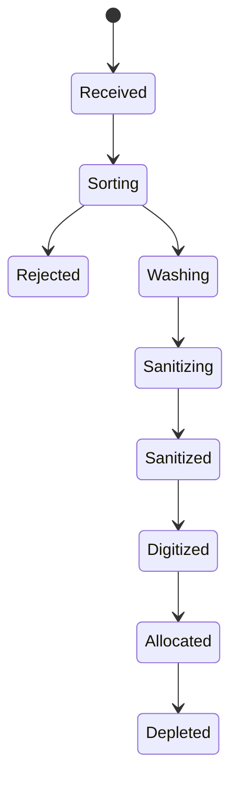
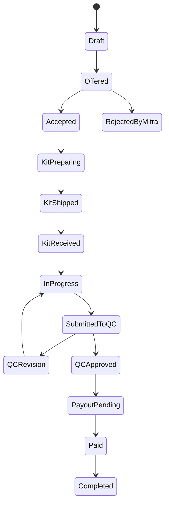

# Product Requirements Document (PRD)
# EcoThread — Platform Manufaktur Sirkular Terdesentralisasi

**Versi:** 1.0  
**Status:** Draft untuk Pengembangan MVP  
**Pemilik Produk:** Tim EcoThread  
**Dokumen Acuan:** `Salinan dasar ide(3).pdf`  
**Platform:** Web responsif / Progressive Web App  
**Role Utama:** Admin, Mitra, User  
**Target MVP:** GEMASTIK XIX — Divisi Bisnis TIK

---

## 1. Ringkasan Produk

EcoThread adalah platform Fashion Technology dan Circular Economy yang menghubungkan pengelola City Hub, mitra penjahit lokal, dan konsumen dalam satu rantai produksi tekstil sirkular.

Platform mengubah limbah tekstil menjadi produk fashion bernilai tinggi melalui alur:

1. Pengadaan dan pemilahan limbah tekstil.
2. Pembersihan serta sterilisasi material.
3. Digitalisasi material menggunakan Computer Vision.
4. Pembuatan desain dan draft pola berbantuan AI.
5. Pembentukan paket produksi atau **Eco-Kit**.
6. Distribusi pekerjaan kepada mitra penjahit.
7. Quality Control dan pembayaran mitra.
8. Pembuatan **Digital Product Passport (DPP)**.
9. Penjualan, pelacakan produk, dan program pengembalian produk.

Produk harus membuktikan bahwa proses upcycling dapat dijalankan secara terstandar, transparan, terukur, dan dapat diskalakan tanpa membangun pabrik terpusat.

---

## 2. Latar Belakang dan Masalah

### 2.1 Masalah Lingkungan

Limbah tekstil memiliki karakteristik yang tidak seragam, seperti jenis kain, ukuran, warna, tingkat kerusakan, dan tekstur. Kondisi tersebut membuat proses pemanfaatan kembali material sulit distandarisasi.

### 2.2 Masalah Mitra Penjahit

Penjahit lokal memiliki keterampilan produksi, tetapi sering mengalami:

- kapasitas produksi yang tidak terpakai;
- akses pasar yang terbatas;
- ketergantungan pada pekerjaan bernilai rendah;
- kesulitan memperoleh desain dan pola yang kompleks;
- pembayaran yang tidak transparan;
- kesulitan membuktikan kualitas serta rekam jejak pekerjaan.

### 2.3 Masalah Konsumen

Konsumen, khususnya Gen Z dan eco-conscious millennials, membutuhkan:

- produk fashion unik dan terjangkau;
- jaminan kebersihan material bekas;
- transparansi asal material;
- informasi pembuat produk;
- bukti dampak lingkungan;
- pengalaman belanja yang personal;
- mekanisme pengembalian atau pemanfaatan ulang produk.

### 2.4 Masalah Operasional

Produksi terdistribusi menghadirkan risiko:

- kualitas hasil mitra tidak konsisten;
- status produksi sulit dipantau;
- data material dan produk terpisah;
- proses pembayaran rentan tidak transparan;
- klaim keberlanjutan sulit diverifikasi;
- data produk dapat berubah tanpa jejak audit.

---

## 3. Visi Produk

Menjadi sistem operasi digital untuk manufaktur fashion sirkular yang mempertemukan limbah tekstil, kecerdasan buatan, keterampilan penjahit lokal, serta transparansi Digital Product Passport dalam satu ekosistem terintegrasi.

---

## 4. Tujuan Produk

### 4.1 Tujuan Utama MVP

MVP harus membuktikan satu alur produksi nyata dari material limbah hingga produk dapat dipindai oleh konsumen.

```text
Material masuk
→ digitalisasi
→ pembuatan draft pola
→ Eco-Kit
→ penugasan mitra
→ produksi
→ QC
→ pembayaran
→ DPP
→ pemindaian oleh user
```

### 4.2 Sasaran Produk

1. Menghubungkan Admin, Mitra, dan User pada satu sumber data.
2. Mengurangi proses pencatatan manual dalam rantai produksi.
3. Menyediakan pelacakan status produksi secara end-to-end.
4. Membantu Admin menghasilkan draft desain dan pola yang dapat divalidasi.
5. Memastikan Mitra mendapatkan instruksi dan pembayaran yang transparan.
6. Menyediakan DPP dinamis untuk setiap produk.
7. Menyediakan bukti proses dan dampak yang dapat diaudit.
8. Menghasilkan data pilot untuk validasi bisnis.

---

## 5. Prinsip Produk

1. **Real before impressive** — fitur sederhana yang benar-benar bekerja lebih diprioritaskan daripada simulasi teknologi yang tidak terintegrasi.
2. **Human-in-the-loop** — output AI wajib dapat diperiksa, dikoreksi, dan disetujui manusia sebelum dipakai untuk produksi.
3. **Traceable by default** — setiap perubahan penting harus memiliki waktu, pelaku, status, dan bukti.
4. **Mobile-first for Mitra and User** — antarmuka Mitra dan User harus optimal di perangkat seluler.
5. **Operational clarity** — setiap pesanan harus memiliki status tunggal yang jelas.
6. **Data integrity** — data aktual, target, simulasi, dan benchmark tidak boleh dicampur.
7. **Accessible UX** — fitur Mitra harus menggunakan bahasa sederhana, ukuran teks cukup besar, dan alur kerja minimal.

---

## 6. Ruang Lingkup Produk

### 6.1 Dalam Lingkup MVP

- autentikasi dan otorisasi berbasis role;
- dashboard Admin;
- aplikasi Mitra;
- aplikasi User;
- manajemen material;
- digital material map;
- draft desain dan pola;
- validasi pola oleh Admin;
- pembuatan Eco-Kit;
- penugasan produksi;
- pelacakan status order;
- unggah bukti produksi;
- Quality Control;
- pencatatan pembayaran mitra;
- pembuatan produk final;
- QR Code DPP;
- halaman DPP dinamis;
- katalog produk;
- pre-order atau checkout sederhana;
- pengajuan Eco-Trade;
- notifikasi dalam aplikasi;
- audit log;
- dashboard metrik pilot.

### 6.2 Di Luar Lingkup MVP

- aplikasi native Android/iOS;
- marketplace pola global;
- otomatisasi AI tanpa validasi manusia;
- token cryptocurrency untuk user;
- sistem ERP lengkap;
- integrasi logistik multi-provider penuh;
- AI visual QC otomatis sebagai keputusan final;
- perdagangan NFT sekunder;
- multi-country operation;
- sistem akuntansi perusahaan lengkap;
- dynamic pricing otomatis.

---

## 7. Role dan Hak Akses

### 7.1 Admin

Admin adalah pengelola City Hub dan pusat kendali operasional.

**Tanggung jawab:**

- memverifikasi akun Mitra;
- mencatat material masuk;
- mengelola proses sanitasi;
- menjalankan digitalisasi material;
- membuat atau memvalidasi desain;
- membuat dan menyetujui pola;
- membuat Eco-Kit;
- menugaskan order kepada Mitra;
- memantau produksi;
- melakukan QC;
- mencatat dan melepas pembayaran;
- membuat DPP;
- mengelola produk dan transaksi;
- melihat metrik operasional;
- mengelola user, role, dan master data.

Walaupun hanya terdapat satu role `admin`, antarmuka dapat mengelompokkan fungsi menjadi Operations, Inventory, AI/Pattern, Mitra Management, Quality Control, Finance, DPP, Commerce, dan Analytics.

### 7.2 Mitra

Mitra adalah penjahit, artisan, atau UMKM konveksi yang menerima pekerjaan dari EcoThread.

**Tanggung jawab:**

- melengkapi profil dan keahlian;
- mengatur kapasitas kerja;
- menerima atau menolak penugasan;
- mengonfirmasi penerimaan Eco-Kit;
- mengikuti panduan produksi;
- memperbarui progres;
- mengunggah bukti pengerjaan;
- mengirim hasil ke QC;
- menerima permintaan revisi;
- melihat upah dan status pembayaran;
- membangun portofolio produksi.

### 7.3 User

User adalah konsumen akhir yang membeli, memesan, memindai, dan mengembalikan produk EcoThread.

**Tanggung jawab:**

- membuat akun;
- melihat katalog;
- melihat detail produk;
- melakukan pre-order atau pembelian;
- memilih ukuran atau preferensi;
- memantau order;
- memindai QR/NFC;
- melihat DPP;
- melihat profil pembuat;
- melihat dampak lingkungan;
- mengajukan Eco-Trade;
- memberikan ulasan atau apresiasi;
- mengelola Eco-Credits.

---

## 8. Matriks Hak Akses

| Modul | Admin | Mitra | User |
|---|:---:|:---:|:---:|
| Login dan profil | Ya | Ya | Ya |
| Kelola user | Ya | Tidak | Tidak |
| Verifikasi Mitra | Ya | Tidak | Tidak |
| Material inventory | CRUD | View terkait order | Tidak |
| Sanitasi material | CRUD | View | View melalui DPP |
| Digital material map | CRUD | View | Tidak |
| AI design | CRUD | View hasil final | Opsi request |
| Pola jahit | CRUD/approve | View/download | Tidak |
| Eco-Kit | CRUD | View assigned | Tidak |
| Penugasan order | CRUD | Accept/reject | Tidak |
| Update progres | Override | Ya | View |
| Upload bukti produksi | View | Ya | Tidak |
| Quality Control | Ya | View hasil | View status |
| Pembayaran Mitra | CRUD/release | View | Tidak |
| Katalog produk | CRUD | Tidak | View |
| Checkout/pre-order | Monitor | Tidak | Ya |
| DPP | Create/update/mint | View produk sendiri | View |
| Eco-Trade | Process | Rework task opsional | Submit |
| Analytics | Semua | Pribadi | Pribadi |
| Audit log | Ya | Terbatas | Tidak |

---

## 9. Persona Utama

### 9.1 Admin — Pengelola City Hub

**Nama contoh:** Raka  
**Tujuan:** memastikan material, desain, produksi, QC, dan DPP berjalan tanpa kehilangan data.  
**Masalah:** data tersebar, sulit memonitor mitra, sulit menghubungkan material ke produk final.  
**Kebutuhan:** dashboard operasional, status yang jelas, bukti visual, audit trail.

### 9.2 Mitra — Penjahit Lokal

**Nama contoh:** Ibu Siti  
**Tujuan:** mendapatkan order stabil, panduan jelas, dan pembayaran adil.  
**Masalah:** order tidak stabil, pola rumit, komunikasi tidak terstruktur.  
**Kebutuhan:** aplikasi sederhana, instruksi visual, status pembayaran, notifikasi.

### 9.3 User — Konsumen Eco-Conscious

**Nama contoh:** Nadia  
**Tujuan:** membeli produk unik, transparan, dan berdampak positif.  
**Masalah:** sustainable fashion mahal, greenwashing, tidak tahu asal produk.  
**Kebutuhan:** katalog menarik, DPP, harga transparan, impact metrics, Eco-Trade.

---

## 10. User Journey Utama

### 10.1 Journey Admin

```text
Login
→ Dashboard
→ Catat material
→ Tandai sanitasi selesai
→ Upload foto material
→ Jalankan segmentasi
→ Koreksi area usable/cacat
→ Pilih desain
→ Buat draft pola
→ Validasi pola
→ Buat Eco-Kit
→ Pilih Mitra
→ Assign order
→ Pantau progres
→ Review QC
→ Approve
→ Lepas pembayaran
→ Buat produk final
→ Generate DPP dan QR
→ Publish produk
```

### 10.2 Journey Mitra

```text
Login
→ Lihat order baru
→ Lihat fee, deadline, material, pola
→ Terima order
→ Konfirmasi Eco-Kit diterima
→ Mulai pengerjaan
→ Ikuti panduan
→ Update progres
→ Upload foto depan/belakang/detail
→ Kirim ke QC
→ Terima approve atau revisi
→ Lihat pembayaran
```

### 10.3 Journey User

```text
Buka aplikasi
→ Lihat katalog
→ Buka detail produk
→ Pilih ukuran/preferensi
→ Checkout atau bayar deposit
→ Pantau order
→ Produk diterima
→ Scan QR/NFC
→ Lihat DPP
→ Beri ulasan/apresiasi
→ Ajukan Eco-Trade saat produk tidak dipakai
```

---

## 11. Kebutuhan Fungsional Global

### 11.1 Autentikasi

#### FR-AUTH-001 — Registrasi User

User dapat mendaftar menggunakan nama, email, nomor telepon, password, serta persetujuan syarat dan privasi.

**Acceptance Criteria:**

- email dan nomor telepon harus unik;
- password minimal 8 karakter;
- role default adalah `user`;
- akun langsung aktif atau melalui verifikasi email/OTP.

#### FR-AUTH-002 — Registrasi Mitra

Mitra dapat mengajukan akun dengan nama, nomor telepon, email, alamat, wilayah, keahlian, pengalaman, kapasitas, rekening/e-wallet, foto identitas, dan portofolio.

**Acceptance Criteria:**

- akun Mitra berstatus `pending_verification`;
- Mitra belum dapat menerima order sebelum disetujui Admin;
- Admin dapat approve atau reject dengan alasan.

#### FR-AUTH-003 — Login

Semua role dapat login menggunakan email/telepon dan password.

#### FR-AUTH-004 — Role-Based Access Control

Setiap endpoint dan halaman harus memverifikasi role dari server, bukan hanya menyembunyikan tombol di frontend.

#### FR-AUTH-005 — Reset Password

User dapat meminta tautan atau OTP untuk mengganti password.

### 11.2 Notifikasi

Sistem menyediakan notifikasi dalam aplikasi untuk akun Mitra disetujui/ditolak, order baru, Eco-Kit dikirim, deadline mendekat, QC disetujui/ditolak, revisi, pembayaran, perubahan order User, DPP aktif, dan Eco-Trade.

```text
id
recipient_id
type
title
message
entity_type
entity_id
read_at
created_at
```

### 11.3 Audit Log

Semua aksi kritis harus dicatat, termasuk perubahan status material, sanitasi, approval pola, assign order, perubahan deadline, QC, pembayaran, DPP, dan impact metrics.

```text
actor
action
entity
entity_id
old_value
new_value
timestamp
ip/device optional
```

---

## 12. Modul Admin

### 12.1 Dashboard Admin

Dashboard menampilkan material masuk, material menunggu sanitasi, pola menunggu validasi, Eco-Kit siap dikirim, order aktif, order terlambat, QC pending, pembayaran pending, produk siap DPP, transaksi User, Mitra aktif, limbah dialihkan, upah dibayarkan, dan produk terjual.

**Aturan:** seluruh angka harus berasal dari database aktual. Data simulasi wajib memiliki label `Demo Data`.

### 12.2 Manajemen Material

#### FR-ADM-MAT-001 — Catat Batch Material

```text
batch_code
source_type
source_name
source_reference
received_date
material_type
color
weight_kg
estimated_area
condition_grade
contamination_status
storage_location
photos
notes
```

#### FR-ADM-MAT-002 — Status Material

```text
received
sorting
rejected
washing
sanitizing
sanitized
digitized
allocated
depleted
```

#### FR-ADM-MAT-003 — Bukti Sanitasi

Admin mengunggah metode sanitasi, waktu mulai/selesai, operator, foto bukti, catatan, dan hasil inspeksi.

**Business Rules:**

- material tidak dapat didigitalisasi jika belum `sanitized`;
- material `rejected` tidak dapat dialokasikan;
- setiap batch harus memiliki sumber dan berat;
- perubahan berat setelah sorting harus dicatat.

### 12.3 Digital Material Map

#### FR-ADM-AI-001 — Upload Foto Material

Admin mengunggah foto material menggunakan penanda kalibrasi.

#### FR-ADM-AI-002 — Segmentasi Material

Sistem menghasilkan mask material, area background, area usable, area defect, estimasi luas, dan confidence score.

#### FR-ADM-AI-003 — Koreksi Manual

Admin dapat menambah/menghapus area defect, memperbaiki batas material, mengubah ukuran kalibrasi, dan menyimpan versi koreksi.

#### FR-ADM-AI-004 — Hasil Digitalisasi

```text
material_map_id
material_batch_id
source_image
mask_image
usable_area_cm2
defect_area_cm2
model_name
model_version
confidence
review_status
reviewed_by
reviewed_at
```

**Business Rules:**

- output AI berstatus `draft`;
- hanya output `approved` yang dapat dipakai untuk desain;
- perubahan manual disimpan sebagai versi baru;
- model dan versinya wajib tercatat.

### 12.4 AI Design dan Pattern

#### FR-ADM-DES-001 — Buat Design Request

Admin memilih material map, jenis produk, target ukuran, style, warna, constraint, referensi desain, dan target efisiensi kain.

#### FR-ADM-DES-002 — Generate Design Draft

Sistem menghasilkan satu atau beberapa desain visual.

#### FR-ADM-DES-003 — Pilih Desain

Admin memilih desain untuk diteruskan menjadi draft pola.

#### FR-ADM-PAT-001 — Generate Draft Pattern

Output minimal:

- preview pola;
- daftar panel;
- ukuran;
- seam allowance;
- stitching notes;
- estimasi kebutuhan material;
- file PDF;
- file DXF jika tersedia.

#### FR-ADM-PAT-002 — Validasi Manusia

Admin/pattern maker dapat approve, reject, meminta regenerate, upload pola revisi, menambahkan catatan, dan memberi nomor versi.

**Status pola:**

```text
draft
ai_generated
under_review
revision_required
approved
archived
```

**Business Rules:**

- pola belum boleh dikirim ke Mitra sebelum `approved`;
- label “production-ready” hanya muncul setelah validasi manusia;
- output AI tidak boleh diklaim presisi tanpa hasil uji fisik;
- satu pola dapat memiliki banyak versi, tetapi hanya satu versi aktif.

### 12.5 Eco-Kit

#### FR-ADM-KIT-001 — Buat Eco-Kit

Eco-Kit menghubungkan material batch, pattern version, accessories, NFC/QR tag, packaging, estimated output, target product, deadline produksi, dan fee Mitra.

#### FR-ADM-KIT-002 — Checklist Eco-Kit

- material sesuai;
- material sudah sanitasi;
- pola telah disetujui;
- aksesori lengkap;
- tag tersedia;
- panduan tersedia;
- berat tercatat;
- foto paket tersedia.

**Status Eco-Kit:**

```text
draft
ready
assigned
packed
shipped
received_by_mitra
in_production
returned_to_hub
closed
```

**Business Rules:**

- Eco-Kit hanya `ready` jika seluruh checklist terpenuhi;
- satu Eco-Kit hanya dapat aktif pada satu order produksi;
- kekurangan aksesori mengunci proses pengiriman.

### 12.6 Manajemen Mitra

#### FR-ADM-MIT-001 — Verifikasi Mitra

Admin melihat dokumen, portofolio, lokasi, dan kemampuan.

#### FR-ADM-MIT-002 — Rating Internal

Penilaian: kualitas, ketepatan waktu, komunikasi, rework rate, dan kapasitas.

#### FR-ADM-MIT-003 — Kapasitas

```text
available
limited
busy
inactive
```

#### FR-ADM-MIT-004 — Pencarian Mitra

Filter berdasarkan lokasi, radius, skill, rating, kapasitas, completion rate, dan jenis produk.

**Business Rules:**

- Mitra `inactive` atau belum terverifikasi tidak dapat menerima order;
- Mitra tidak boleh menerima order melebihi kapasitas aktif;
- assignment wajib mempertimbangkan skill yang sesuai.

### 12.7 Penugasan Produksi

#### FR-ADM-ORD-001 — Buat Production Order

```text
order_code
eco_kit_id
mitra_id
product_type
size
quantity
fee
deadline
priority
shipping_method
notes
```

#### FR-ADM-ORD-002 — Assign Order

Admin memilih Mitra dan mengirim penugasan.

#### FR-ADM-ORD-003 — Monitor Progress

Admin melihat status, timeline, progress, bukti foto, deadline, keterlambatan, komunikasi, dan QC history.

**Status Production Order:**

```text
draft
offered
accepted
rejected_by_mitra
kit_preparing
kit_shipped
kit_received
in_progress
submitted_to_qc
qc_revision
qc_approved
payout_pending
paid
completed
cancelled
```

**Business Rules:**

- order `offered` memiliki batas waktu penerimaan;
- jika Mitra menolak, Admin dapat reassign;
- perubahan fee setelah accepted membutuhkan persetujuan Mitra;
- order tidak dapat `completed` sebelum QC approved dan pembayaran tercatat.

### 12.8 Quality Control

#### FR-ADM-QC-001 — Review Submission

Admin melihat foto depan, belakang, detail, video opsional, ukuran aktual, catatan Mitra, pattern version, dan target spesifikasi.

#### FR-ADM-QC-002 — Checklist QC

- jahitan rapi;
- tidak ada benang lepas;
- ukuran sesuai;
- pola sejajar;
- aksesori berfungsi;
- material bersih;
- tidak ada cacat terlihat;
- tag terpasang;
- finishing sesuai.

#### FR-ADM-QC-003 — Keputusan QC

```text
approve
minor_revision
major_revision
reject
```

#### FR-ADM-QC-004 — Catatan Revisi

Temuan, lokasi cacat, foto anotasi, tindakan perbaikan, dan deadline revisi wajib tersedia.

**Business Rules:**

- Admin tidak boleh approve tanpa checklist;
- keputusan memiliki reviewer dan timestamp;
- produk reject tidak dapat dibuatkan DPP;
- seluruh riwayat QC dipertahankan.

### 12.9 Pembayaran Mitra

#### FR-ADM-PAY-001 — Buat Payout

Payout dibuat setelah QC approved.

#### FR-ADM-PAY-002 — Review Nominal

Admin melihat base fee, bonus, penalti yang disetujui, total, dan tujuan pembayaran.

#### FR-ADM-PAY-003 — Release Payment

Pada MVP, sistem dapat mencatat pembayaran manual, mengunggah bukti transfer, dan menyimpan reference number.

**Status pembayaran:**

```text
not_eligible
pending
approved
processing
paid
failed
cancelled
```

**Business Rules:**

- payout tidak boleh dibuat saat QC pending;
- status `paid` membutuhkan bukti atau reference;
- perubahan nominal masuk audit log;
- Mitra dapat melihat rincian pembayaran.

### 12.10 Produk dan DPP

#### FR-ADM-DPP-001 — Buat Produk Final

```text
product_code
production_order_id
name
category
size
price
before_photo
after_photo
maker_id
material_batch_ids
qc_id
impact_record_id
status
```

#### FR-ADM-DPP-002 — Generate QR

```text
https://app.ecothread.id/dpp/{product_code}
```

#### FR-ADM-DPP-003 — DPP Metadata

DPP menampilkan identitas produk, foto before/after, asal material, sanitasi, AI/design process, pattern version, profil pembuat, timeline produksi, hasil QC, impact metrics, authenticity record, care instructions, dan Eco-Trade eligibility.

#### FR-ADM-DPP-004 — Blockchain Anchoring

Data minimum:

- chain ID;
- contract address;
- token ID;
- transaction hash;
- metadata URI;
- block explorer URL.

**Business Rules:**

- jangan menampilkan “Blockchain Verified” sebelum transaksi berhasil;
- kegagalan blockchain tidak menghapus DPP database;
- perubahan metadata setelah anchoring menghasilkan versi baru;
- impact metrics memiliki metode dan sumber input.

### 12.11 Commerce Admin

Admin dapat mengelola katalog, stok/pre-order, harga, order User, status pembayaran, pengiriman, refund/cancel, voucher/Eco-Credits, dan Eco-Trade request.

---

## 13. Modul Mitra

### 13.1 Dashboard Mitra

Menampilkan order baru, order aktif, deadline terdekat, QC revision, saldo tersedia, pembayaran pending, rating, dan total order selesai.

### 13.2 Profil dan Kapasitas

Mitra dapat mengubah foto, bio, keahlian, alat yang dimiliki, kapasitas mingguan, wilayah, rekening, dan status ketersediaan.

**Business Rules:**

- perubahan rekening membutuhkan verifikasi;
- Mitra tidak dapat mengubah rating;
- dokumen sensitif tidak ditampilkan publik.

### 13.3 Penerimaan Order

Mitra melihat produk, fee, deadline, material, pattern, kompleksitas, alamat pengiriman, dan catatan.

Mitra dapat menerima, menolak, mengajukan pertanyaan, atau mengusulkan penyesuaian deadline sebelum menerima.

**Business Rules:**

- penolakan memiliki alasan;
- order yang sudah diterima tidak dapat dibatalkan sepihak;
- Mitra menyetujui fee dan deadline.

### 13.4 Eco-Kit Receipt

Mitra mengonfirmasi paket diterima, material lengkap, aksesori lengkap, pola dapat dibuka, dan kondisi material baik. Jika ada masalah, Mitra membuat issue dengan foto.

### 13.5 Panduan Produksi

Panduan terdiri dari langkah, foto/video, durasi, catatan, safety note, pattern panel, ukuran, dan completion checkbox.

### 13.6 Update Progres

```text
kit_received
material_checked
cutting
assembly
sewing
finishing
ready_for_qc
submitted
```

**Business Rules:**

- progress dihitung berdasarkan milestone, bukan persentase manual semata;
- setiap milestone dapat memiliki foto;
- status tidak dapat mundur tanpa alasan.

### 13.7 Submission QC

Mitra wajib mengunggah minimal foto depan, belakang, detail jahitan, ukuran aktual, dan catatan.

### 13.8 Revisi

Mitra melihat daftar temuan, foto anotasi, prioritas, deadline, dan status; kemudian mengunggah bukti revisi sebelum submit ulang.

### 13.9 Wallet dan Pembayaran

Mitra melihat pendapatan total, saldo tersedia, saldo pending, rincian per order, bonus, potongan, status pembayaran, dan bukti transfer.

Pada MVP, “wallet” adalah ledger internal, bukan dompet cryptocurrency.

---

## 14. Modul User

### 14.1 Onboarding

User dapat mendaftar, memilih preferensi style, memasukkan ukuran, kota, dan minat keberlanjutan. Data preferensi bersifat opsional.

### 14.2 Katalog

**Filter:** kategori, ukuran, warna, harga, ready stock, pre-order, material, style, dan impact.

**Card produk:** gambar, nama, harga, badge upcycled, stok/pre-order, pembuat opsional, dan impact highlight.

### 14.3 Detail Produk

Memuat galeri, deskripsi, material, ukuran, harga, estimasi produksi, maker, sanitasi, impact, metode pemesanan, kebijakan retur, dan preview DPP.

### 14.4 Pre-Order dan Checkout

User memilih ukuran, quantity, variasi, alamat, catatan, dan metode pembayaran.

Sistem mendukung full payment, deposit, payment proof manual untuk MVP, dan payment gateway pada fase berikutnya.

**Status Customer Order:**

```text
pending_payment
paid
confirmed
in_production
quality_control
ready_to_ship
shipped
delivered
completed
cancelled
refunded
```

**Business Rules:**

- user melihat estimasi produksi;
- pre-order menyatakan produk dibuat sesuai kapasitas;
- status User tidak menampilkan detail internal sensitif;
- pembatalan mengikuti tahap produksi.

### 14.5 Order Tracking

Timeline: pembayaran diterima, material disiapkan, diproduksi Mitra, Quality Control, DPP aktif, dikirim, dan diterima.

### 14.6 Digital Product Passport

DPP dapat dibuka tanpa login.

**Tampilan:**

1. Hero product.
2. Product ID.
3. Verification status.
4. Before and after.
5. Journey timeline.
6. Material source.
7. Sanitization.
8. AI-assisted design.
9. Meet the Maker.
10. QC result.
11. Impact metrics.
12. Blockchain record jika tersedia.
13. Care and repair.
14. Eco-Trade CTA.

**Privacy Rules:**

- alamat lengkap dan nomor telepon Mitra tidak ditampilkan;
- informasi sumber material sensitif dapat diringkas;
- data publik harus disetujui Admin.

### 14.7 Eco-Trade

User mengajukan pengembalian dengan product ID, alasan, kondisi, foto, dan alamat pickup/drop-off.

```text
submitted
under_review
approved
pickup_scheduled
received
inspected
credit_issued
rejected
closed
```

**Business Rules:**

- hanya produk valid yang dapat diajukan;
- nilai kredit ditentukan setelah inspeksi;
- Eco-Credits tidak dapat diuangkan;
- masa berlaku kredit terlihat.

### 14.8 Ulasan dan Apresiasi

User dapat memberi rating produk, rating pengalaman, mengirim pesan terima kasih, dan memberikan tip jika payment system mendukung. Konten harus melalui moderasi.

---

## 15. Status Lifecycle Utama

### 15.1 Material



### 15.2 Production Order



### 15.3 DPP

```text
draft
→ metadata_ready
→ qr_generated
→ anchoring
→ verified
→ published
```

Jika blockchain gagal, status menjadi `anchoring_failed`, tetapi DPP database tetap dapat diakses dengan label yang jujur.

---

## 16. Business Rules Inti

1. Material belum tersanitasi tidak dapat digunakan.
2. Draft pola AI wajib melalui validasi manusia.
3. Eco-Kit tidak dapat dikirim jika checklist belum lengkap.
4. Mitra belum terverifikasi tidak dapat menerima order.
5. Fee dan deadline harus disetujui Mitra.
6. Submission QC membutuhkan bukti minimum.
7. Produk tidak dapat dibuat sebelum QC approved.
8. Pembayaran tidak dapat dilepas sebelum QC approved.
9. DPP tidak dapat published tanpa produk final.
10. Label blockchain hanya muncul setelah transaksi nyata berhasil.
11. Impact metrics menyimpan formula, sumber, dan versi metodologi.
12. Data simulasi harus diberi label.
13. Setiap perubahan status kritis masuk audit log.
14. Satu produk final memiliki satu product code unik.
15. QR tidak boleh menggunakan URL yang mudah berubah.
16. Data sensitif Mitra tidak boleh tampil publik.
17. Order User tidak dianggap traction sebelum pembayaran/deposit tercatat.
18. Status `completed` berarti produksi, pembayaran, dan data produk selesai.
19. Rework masuk histori QC.
20. Penghapusan data operasional menggunakan soft delete.

---

## 17. Kebutuhan Data

### 17.1 Entitas Utama

```text
users
user_profiles
mitra_profiles
mitra_skills
mitra_documents
addresses
material_sources
material_batches
material_images
sanitization_records
material_maps
design_requests
design_outputs
patterns
pattern_versions
eco_kits
eco_kit_items
production_orders
production_progress
production_evidence
qc_reviews
qc_findings
payouts
products
product_materials
dpp_records
dpp_events
impact_records
catalog_items
customer_orders
customer_order_items
payments
shipments
reviews
eco_trade_requests
eco_credit_ledger
notifications
audit_logs
```

### 17.2 Relasi Kritis

```text
Material Batch
  └── Material Map
        └── Design Request
              └── Pattern
                    └── Eco-Kit
                          └── Production Order
                                ├── Mitra
                                ├── QC Review
                                ├── Payout
                                └── Product
                                      ├── DPP
                                      ├── Impact Record
                                      └── Customer Order
```

---

## 18. API Minimum

### 18.1 Authentication

```http
POST /auth/register
POST /auth/login
POST /auth/logout
POST /auth/forgot-password
POST /auth/reset-password
GET  /me
```

### 18.2 Admin Material

```http
GET    /admin/material-batches
POST   /admin/material-batches
GET    /admin/material-batches/:id
PATCH  /admin/material-batches/:id
POST   /admin/material-batches/:id/sanitization
POST   /admin/material-batches/:id/images
```

### 18.3 AI dan Pattern

```http
POST   /admin/material-maps
PATCH  /admin/material-maps/:id
POST   /admin/design-requests
POST   /admin/design-requests/:id/generate
POST   /admin/patterns
POST   /admin/patterns/:id/approve
POST   /admin/patterns/:id/revise
```

### 18.4 Eco-Kit dan Produksi

```http
POST   /admin/eco-kits
POST   /admin/production-orders
POST   /admin/production-orders/:id/assign
GET    /mitra/orders
POST   /mitra/orders/:id/accept
POST   /mitra/orders/:id/reject
POST   /mitra/orders/:id/progress
POST   /mitra/orders/:id/submit-qc
```

### 18.5 QC dan Pembayaran

```http
GET    /admin/qc-reviews
POST   /admin/qc-reviews/:id/decision
POST   /admin/payouts
POST   /admin/payouts/:id/release
GET    /mitra/payouts
```

### 18.6 Produk dan DPP

```http
POST   /admin/products
POST   /admin/products/:id/dpp
POST   /admin/dpp/:id/anchor
GET    /dpp/:productCode
```

### 18.7 Commerce

```http
GET    /catalog
GET    /catalog/:slug
POST   /orders
GET    /orders/:id
POST   /orders/:id/payment
POST   /eco-trade
GET    /me/eco-credits
```

---

## 19. Kebutuhan Non-Fungsional

### 19.1 Keamanan

- password di-hash;
- token memiliki expiry;
- RBAC divalidasi server;
- file upload divalidasi tipe dan ukuran;
- rate limiting;
- audit log;
- data sensitif terenkripsi;
- private key blockchain tidak disimpan di frontend;
- environment variable tidak masuk repository;
- akses storage menggunakan signed URL;
- backup database berkala.

### 19.2 Performa

- halaman utama < 3 detik pada jaringan 4G;
- API non-AI p95 < 800 ms;
- thumbnail untuk galeri;
- pagination untuk list besar;
- proses AI asynchronous;
- user melihat status job, bukan loading tanpa batas.

### 19.3 Reliabilitas

- retry untuk proses AI dan blockchain;
- idempotency untuk pembayaran dan minting;
- status failure terlihat;
- tidak ada silent failure;
- data produksi tidak hilang saat refresh.

### 19.4 Aksesibilitas

- kontras minimum WCAG AA;
- ukuran tombol Mitra minimal 44x44 px;
- teks utama Mitra minimal 16 px;
- form memiliki label;
- status tidak hanya dibedakan dengan warna;
- dukungan keyboard untuk Admin.

### 19.5 Responsiveness

- Admin: desktop-first, tetap usable di tablet;
- Mitra: mobile-first;
- User: mobile-first;
- DPP: dapat dibuka pada browser tanpa instalasi.

### 19.6 Observability

- error logging;
- job monitoring;
- audit trail;
- health check;
- analytics event;
- notification failure log.

---

## 20. UX Requirement

### 20.1 Admin

- informasi padat tetapi terstruktur;
- navigasi berdasarkan tahapan operasi;
- filter dan pencarian;
- status badge konsisten;
- aksi kritis membutuhkan konfirmasi;
- detail entity memiliki timeline.

### 20.2 Mitra

- bahasa Indonesia sederhana;
- hindari jargon AI dan blockchain;
- satu layar satu tugas utama;
- progress visual;
- tombol besar;
- instruksi berbasis gambar/video;
- offline-friendly untuk panduan yang telah dibuka;
- pesan sukses dan error jelas.

### 20.3 User

- visual produk dominan;
- harga dan estimasi produksi mudah ditemukan;
- transparansi tidak terasa seperti laporan teknis;
- impact metrics disertai metode singkat;
- CTA checkout dan Eco-Trade jelas;
- DPP dapat dibagikan.

---

## 21. Error dan Empty State

Sistem harus menangani kondisi:

- belum ada material;
- gagal upload;
- proses AI antre/gagal;
- pola belum tersedia;
- tidak ada Mitra yang cocok;
- Mitra menolak order;
- Eco-Kit bermasalah;
- QC kosong;
- pembayaran gagal;
- blockchain gagal;
- DPP belum published;
- katalog kosong;
- pembayaran User belum diverifikasi;
- Eco-Trade tidak eligible.

Contoh pesan:

```text
Belum ada Mitra dengan skill Jaket yang tersedia.
Ubah deadline, perluas radius, atau pilih jenis produk lain.
```

---

## 22. Analytics dan Event Tracking

### 22.1 Event Admin

```text
material_created
material_sanitized
material_digitized
design_generated
pattern_approved
eco_kit_ready
order_assigned
qc_approved
qc_rejected
payout_released
dpp_published
```

### 22.2 Event Mitra

```text
order_viewed
order_accepted
order_rejected
kit_received
progress_updated
qc_submitted
revision_submitted
payout_viewed
```

### 22.3 Event User

```text
catalog_viewed
product_viewed
checkout_started
deposit_paid
purchase_paid
dpp_scanned
maker_appreciated
review_submitted
eco_trade_started
eco_trade_submitted
```

---

## 23. Metrik Keberhasilan MVP

### 23.1 Metrik Operasional

- jumlah batch material nyata;
- berat material diproses;
- waktu material-to-pattern;
- waktu assignment;
- order acceptance rate;
- production lead time;
- on-time completion rate;
- first-pass QC rate;
- rework rate;
- payout time;
- jumlah DPP published.

### 23.2 Metrik Mitra

- jumlah Mitra terverifikasi;
- Mitra aktif;
- order per Mitra;
- pendapatan per Mitra;
- tingkat penerimaan order;
- kepuasan Mitra;
- peningkatan utilisasi kapasitas.

### 23.3 Metrik User

- visitor;
- product view;
- checkout start;
- deposit conversion;
- purchase conversion;
- DPP scan rate;
- repeat visit;
- Eco-Trade request;
- willingness to pay;
- review score.

### 23.4 Metrik Dampak

- kilogram limbah dialihkan;
- persentase material usable;
- material utilization rate;
- estimasi air dihemat;
- estimasi emisi dihindari;
- jumlah produk dikembalikan;
- jumlah produk diperbaiki atau dibuat ulang.

---

## 24. Acceptance Criteria End-to-End MVP

MVP dinyatakan berhasil jika skenario berikut dapat dilakukan tanpa mengubah source code atau menggunakan data hard-coded:

1. Admin login.
2. Admin membuat satu batch denim nyata.
3. Admin mencatat sanitasi.
4. Admin mengunggah foto material.
5. Sistem menghasilkan material map.
6. Admin mengoreksi dan menyetujui material map.
7. Admin membuat draft desain/pola.
8. Admin memvalidasi satu versi pola.
9. Admin membuat Eco-Kit.
10. Admin menugaskan Mitra terverifikasi.
11. Mitra login pada akun berbeda.
12. Order muncul di dashboard Mitra.
13. Mitra menerima order.
14. Mitra memperbarui progres.
15. Mitra mengunggah bukti QC.
16. Admin melihat submission.
17. Admin menyetujui QC.
18. Sistem membuat payout pending.
19. Admin mencatat pembayaran.
20. Sistem membuat produk final.
21. Sistem menghasilkan QR unik.
22. User memindai QR.
23. DPP menampilkan data material, Mitra, QC, dan impact yang sesuai.
24. User dapat melakukan pre-order atau tercatat sebagai pembeli/depositor.
25. Seluruh perubahan memiliki audit log.

---

## 25. Strategi Pengembangan Bertahap

### Fase 0 — Fondasi

- monorepo atau struktur aplikasi rapi;
- database;
- authentication;
- role;
- storage;
- environment;
- CI build;
- seed demo terpisah dari data aktual.

### Fase 1 — Core Operations

- material;
- sanitasi;
- Mitra;
- Eco-Kit;
- production order;
- progress;
- QC;
- payout ledger.

### Fase 2 — DPP dan Customer

- product record;
- QR;
- dynamic DPP;
- katalog;
- pre-order;
- customer order.

### Fase 3 — AI-Assisted Pipeline

- upload material;
- segmentation;
- correction;
- design request;
- pattern file;
- human approval.

### Fase 4 — Verifiability

- impact methodology;
- metadata versioning;
- Polygon testnet;
- block explorer;
- DPP verification.

### Fase 5 — Retention

- Eco-Trade;
- Eco-Credits;
- review;
- maker appreciation;
- repeat-order tracking.

---

## 26. Prioritas Backlog

### P0 — Harus Ada

- auth dan role;
- shared backend;
- material batch;
- sanitasi;
- Mitra verification;
- production order;
- progress;
- QC;
- payout record;
- product;
- QR;
- dynamic DPP;
- audit log;
- pilot data.

### P1 — Sangat Penting

- AI material segmentation;
- manual correction;
- pattern validation;
- catalog;
- deposit/pre-order;
- notifications;
- impact formula;
- experiment analytics.

### P2 — Penguatan

- blockchain testnet;
- Eco-Trade;
- Eco-Credits;
- video sewing guide;
- route optimization;
- AI visual QC beta.

### P3 — Masa Depan

- pattern marketplace;
- B2B corporate portal;
- multi-hub;
- smart contract payout;
- customer design generator;
- 3D sewing guide;
- international DPP standard.

---

## 27. Definition of Done

Satu fitur dinyatakan selesai jika:

- requirement terpenuhi;
- validasi role dilakukan di backend;
- memiliki loading, success, error, dan empty state;
- data tersimpan setelah refresh;
- memiliki test minimum;
- audit log tersedia untuk aksi kritis;
- responsif;
- tidak menggunakan data hard-coded sebagai data aktual;
- dokumentasi API diperbarui;
- acceptance criteria lulus;
- sudah melalui review produk dan teknis.

---

## 28. Testing Strategy

### 28.1 Unit Test

- status transition;
- perhitungan fee;
- impact calculation;
- permission helper;
- QR generation;
- metadata hash.

### 28.2 Integration Test

- Admin assign → Mitra menerima;
- Mitra submit → Admin QC;
- QC approve → payout;
- payout paid → completed;
- product → DPP;
- checkout → order.

### 28.3 End-to-End Test

```text
admin@example.com
mitra@example.com
user@example.com
```

Data demo harus berada di environment khusus demo.

### 28.4 User Acceptance Test

Melibatkan minimal 1 Admin operasional, 3 Mitra, dan 5 User.

---

## 29. Risiko Produk dan Mitigasi

| Risiko | Dampak | Mitigasi |
|---|---|---|
| AI output tidak dapat dijahit | Tinggi | Human approval, pattern library |
| Mitra kesulitan aplikasi | Tinggi | Mobile-first, usability testing |
| QC tidak konsisten | Tinggi | Checklist, evidence, reviewer |
| Data impact diragukan | Tinggi | Methodology, source, version |
| Blockchain gagal | Sedang | DPP database tetap aktif |
| Scope terlalu besar | Tinggi | Prioritaskan vertical slice |
| Tidak ada transaksi nyata | Tinggi | Deposit/pre-order pilot |
| Angka dashboard tidak valid | Tinggi | Actual/demo/target label |
| Keterlambatan produksi | Sedang | Capacity dan deadline management |
| Kebocoran data Mitra | Tinggi | Public profile terbatas |
| Biaya cloud AI tinggi | Sedang | Queue, limit, serverless |
| User tidak memahami DPP | Sedang | Storytelling sederhana |

---

## 30. Pertanyaan Terbuka yang Harus Diputuskan Tim

1. Produk pilot pertama: tote bag, outer, atau jaket?
2. Apakah MVP menggunakan full payment atau deposit?
3. Metode pembayaran tahap awal?
4. Siapa validator pola?
5. Formula impact apa yang akan dipakai?
6. Apakah blockchain wajib pada submission pertama?
7. Berapa radius maksimum assignment Mitra?
8. Apakah material dipotong di Hub atau di lokasi Mitra?
9. Apakah Mitra dapat menerima lebih dari satu order?
10. Siapa yang menanggung biaya rework?
11. Bagaimana aturan pembatalan User?
12. Bagaimana nilai Eco-Credits ditentukan?
13. Data Mitra apa yang boleh tampil di DPP?
14. Apakah katalog hanya ready-to-wear atau juga upcycling service?
15. Berapa lama data dan bukti produksi disimpan?

---

## 31. Rekomendasi Keputusan MVP

- gunakan **tote bag atau simple outer** sebagai produk pilot;
- gunakan **deposit** sebagai bukti willingness to pay;
- gunakan pencatatan pembayaran manual terlebih dahulu;
- gunakan **segmentasi + koreksi manusia**;
- gunakan pattern library atau draft pola yang divalidasi;
- gunakan DPP database dinamis sebelum blockchain;
- tambahkan Polygon testnet setelah alur utama stabil;
- mulai dengan 3 Mitra dan 5–10 unit produk;
- tampilkan metrik pilot aktual, bukan angka simulasi.

---

## 32. Ringkasan Produk per Role

### Admin

```text
Kelola material
→ AI-assisted mapping
→ desain dan pola
→ Eco-Kit
→ assignment
→ monitoring
→ QC
→ payout
→ DPP
→ analytics
```

### Mitra

```text
Terima order
→ terima Eco-Kit
→ ikuti panduan
→ update progres
→ submit QC
→ revisi
→ menerima pembayaran
```

### User

```text
Temukan produk
→ pre-order/beli
→ track
→ scan DPP
→ lihat impact dan maker
→ review
→ Eco-Trade
```

---

## 33. Sumber Konsep

PRD ini diturunkan dari dokumen dasar ide EcoThread, terutama bagian ruang lingkup bisnis, value proposition, revenue streams, Neural-Tailor Pipeline, Digital Product Passport, alur produksi Eco-Loop, Quality Control, model manufaktur terdistribusi, serta perencanaan biaya dan target bisnis.

Dokumen ini berfungsi sebagai patokan produk. Perubahan requirement harus dicatat melalui revisi versi PRD dan disetujui oleh Product Owner serta Tech Lead.
